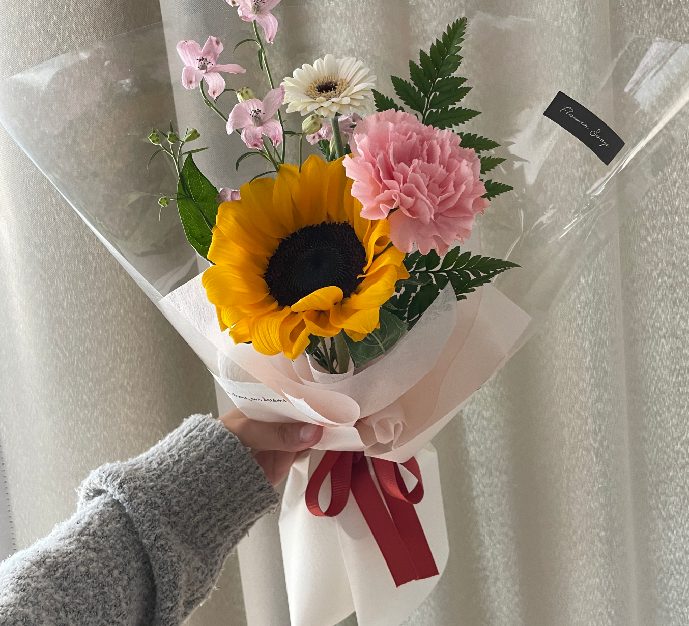

# 내일의 집

### 1. GNB

- 로그인을 하지 않은 경우

```html
<div class="button-group">
  <button class="gnb-icon-button is-search lg-hidden" type="button">
    <i class="ic-search" aria-label="검색창 열기 버튼"></i>
  </button>
  <a class="gnb-icon-button is-cart" href="#">
    <i class="ic-cart" aria-label="장바구니 페이지로 이동 버튼"></i>
  </a>

  <div class="gnb-auth sm-hidden">
    <a href="#">로그인</a>
    <a href="#">회원가입</a>
  </div>
</div>
```

- 로그인을 한 경우

```html
<div class="button-group">
  <button class="gnb-icon-button is-search lg-hidden" type="button">
    <i class="ic-search" aria-label="검색창 열기 버튼"></i>
  </button>

  <a class="gnb-icon-button sm-hidden" href="#">
    <i class="ic-bookmark" aria-label="스크랩북 페이지로 이동 버튼"></i>
  </a>

  <a class="gnb-icon-button sm-hidden" href="#">
    <i class="ic-bell" aria-label="내 소식 페이지로 이동 버튼"></i>
  </a>

  <a class="gnb-icon-button is-cart" href="#">
    <i class="ic-cart" aria-label="장바구니 페이지로 이동 버튼"></i>
    <strong class="badge">5</strong>
  </a>

  <button
    class="gnb-avatar-button sm-hidden"
    type="button"
    aria-label="마이메뉴 버튼"
  >
    <div class="avatar-32">
      
    </div>
  </button>
</div>
```

### 2. Sidebar Header

- 로그인을 하지 않은 경우

```html
<div class="sidebar-auth">
  <a class="btn-outlined btn-40" href="#">로그인</a>
  <a class="btn-primary btn-40" href="#">회원가입</a>
</div>
```

- 로그인을 한 경우

```html
<div class="sidebar-user">
  <a href="#">
    <div class="avatar-24">
      
    </div>
    <strong class="username">이창환</strong>
  </a>
</div>
```

### 3. Product-Review

- 리뷰가 0개일 경우

```html
<section
  class="product-section product-review"
  role="tabpanel"
  id="product-review"
>
  <header class="product-section-header">
    <h1 class="title">리뷰</h1>
    <strong class="badge" aria-label="0개의 리뷰">0</strong>
    <a class="text-button" href="#">리뷰쓰기</a>
  </header>

  <div class="product-section-content">
    <p class="review-empty">
      첫 리뷰를 남겨주세요!<br />
      최대 <strong>500P</strong>를 드립니다.
    </p>
  </div>
</section>
<div class="product-section-divider sm-only" aria-hidden></div>
```

### 4. Product-Inquiry

- 문의가 0개일 경우

```html
<section class="product-section product-inquiry is-open" id="product-inquiry">
  <header class="product-section-header">
    <h1 class="title">문의</h1>
    <strong class="badge" aria-label="0개의 문의">0</strong>
    <a class="text-button" href="#">문의하기</a>
    <button class="icon-button sm-only" type="button" aria-label="더보기">
      <i class="ic-chevron" aria-hidden></i>
    </button>
  </header>

  <div class="product-section-content">
    <p class="inquiry-empty">문의 내역이 없습니다.</p>
  </div>
</section>
<div class="product-section-divider sm-only" aria-hidden></div>
```
